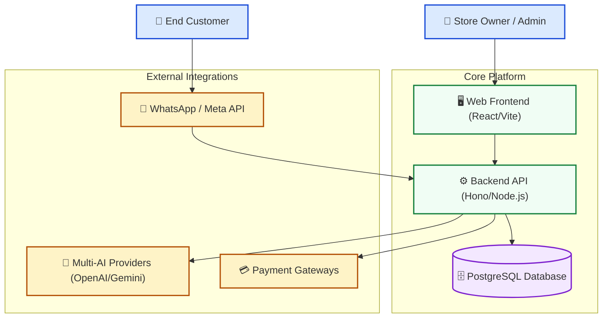
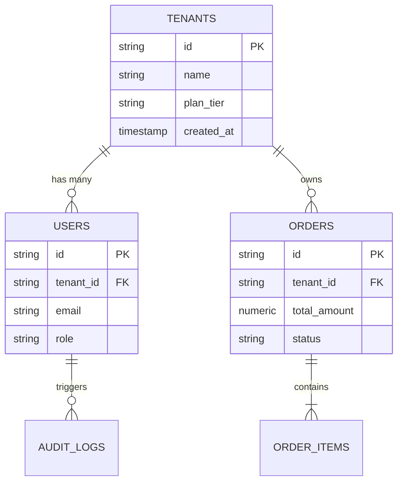
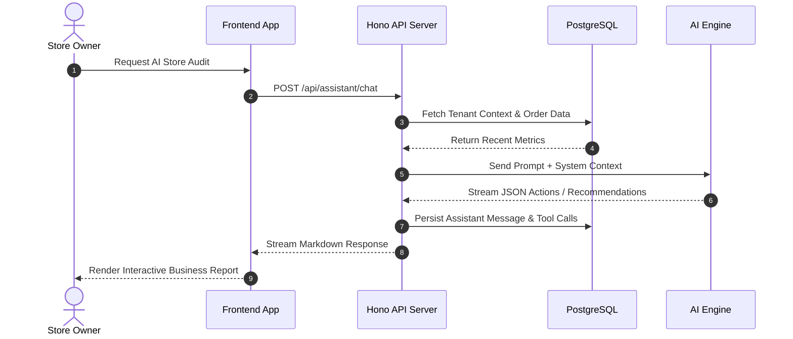

# Codebase Wiki Generator & Auto-Sync Suite (`codebase-wiki-generator`)

Provides an enterprise-grade, multi-dimensional methodology and automated tooling to generate, structure, validate, and **automatically synchronize** comprehensive codebase documentation and architecture wikis across **Single Repositories** or **Multi-Workspace Federated Ecosystems** (e.g. `smart-seller` + `laris.click` + shared modules).

---

## When to Use This Skill

### 1. Creation & Initial Scaffolding
- **Indonesian**: "buat wiki codebase", "buat dokumentasi proyek", "scaffold wiki arsitektur", "bikin dokumentasi lengkap codebase", "generate wiki sistem", "buat multi workspace wiki", "federated wiki".
- **English**: "create codebase wiki", "generate project documentation", "scaffold architecture wiki", "build comprehensive codebase docs", "multi workspace wiki", "federated wiki".

### 2. Automatic & Incremental Update on Changes
- **Indonesian**: "update wiki tiap ada perubahan", "sync wiki dengan codebase", "update dokumentasi API", "perbarui diagram ERD di wiki", "pantau perubahan dan update wiki otomatis", "sync multi workspace".
- **English**: "update wiki on changes", "sync wiki with code", "update API documentation in wiki", "refresh ERD in wiki", "watch codebase and auto-sync wiki", "sync multi workspace".

### 3. Auditing & Link Validation
- **Indonesian**: "cek kesehatan link wiki", "validasi dokumentasi wiki", "audit kelengkapan wiki".
- **English**: "validate wiki links", "audit wiki completeness", "check broken links in docs".

---

## Multi-Workspace & Federated Wiki Architecture

The wiki suite natively supports declarative configuration via `docs/wiki/wiki-config.json`:

```json
{
  "wikiDir": "docs/wiki",
  "title": "Smart Seller & laris.click Federated Technical Wiki",
  "primaryWorkspace": {
    "name": "smart-seller",
    "displayName": "Smart Seller (Core Platform & Store Assistant)",
    "path": ".",
    "routes": ["apps/api/src/routes", "apps/api/src"],
    "schemas": ["packages/db/src/migrations", "packages/db/src"]
  },
  "federatedWorkspaces": [
    {
      "name": "laris.click",
      "displayName": "laris.click (Checkout, SSO & Subscriptions Gateway)",
      "path": "D:/backup from pc asus/Documents Development/laris.click",
      "routes": ["backend/src/routes", "backend/src"],
      "schemas": ["backend/src/db/migrations", "backend/src/db"]
    }
  ]
}
```

When multi-workspace configuration is present:
- **API Catalog (`extract-api-catalog.cjs`)**: Scans routes across all registered repositories and outputs grouped contract tables with clickable source links.
- **Database ERD (`extract-db-erd.cjs`)**: Merges database schemas into unified Mermaid ERDs with cross-system foreign key mappings.
- **Watcher Daemon (`watch-and-sync.cjs`)**: Concurrently listens to file modifications across all workspaces.
- **Incremental Sync (`sync-wiki-on-change.cjs`)**: Calculates cross-workspace impact radiuses and synchronizes semantic Vector RAG chunks into `apps/api/data/wiki-rmemory-chunks.json`.

---

## Architecture & Wiki Taxonomy

The generated wiki lives in `docs/wiki/` (or `.wiki/`) with the following standardized structure:

```text
docs/wiki/
├── 00-index.md                    # Master Table of Contents, Architecture Map & Tech Badges
├── 01-architecture-overview.md    # C4 Context & Container, Monorepo Topology, Design Principles
├── 02-domain-models-and-data.md   # Mermaid ERD, DB Schema Catalog, State Machines, Caching
├── 03-api-and-contracts.md        # REST/RPC Endpoints, Auth Specs, Payload Contracts, Webhooks
├── 04-features-and-workflows.md   # Core Business Flows, Sequence Diagrams, Logic Rules
├── 05-infrastructure-and-devops.md# Docker, CI/CD, Environment Matrix, Logging & Monitoring
├── 06-developer-onboarding.md     # Local Setup, Commands Cheat Sheet, Debugging, Testing Rules
├── 07-adrs-and-decisions.md       # Architecture Decision Records (ADRs) in MADR format
└── auto-sync-manifest.json        # Auto-generated hash & file-mapping manifest for incremental sync
```

---

## 7-Phase Execution Workflow

```
┌────────────────────────────────────────────────────────┐
│ Phase 1: Codebase Discovery & Stack Inspection         │
└───────────────────────────┬────────────────────────────┘
                            │
                            ▼
┌────────────────────────────────────────────────────────┐
│ Phase 2: Scaffold Generation & Template Initialization │
└───────────────────────────┬────────────────────────────┘
                            │
                            ▼
┌────────────────────────────────────────────────────────┐
│ Phase 3: C4 Architecture & Component Modeling (Mermaid)│
└───────────────────────────┬────────────────────────────┘
                            │
                            ▼
┌────────────────────────────────────────────────────────┐
│ Phase 4: Domain Entities, ERD & Data Lifecycle Mapping │
└───────────────────────────┬────────────────────────────┘
                            │
                            ▼
┌────────────────────────────────────────────────────────┐
│ Phase 5: API Catalog & External Contract Extraction    │
└───────────────────────────┬────────────────────────────┘
                            │
                            ▼
┌────────────────────────────────────────────────────────┐
│ Phase 6: Business Workflows & Sequence Flow Modeling   │
└───────────────────────────┬────────────────────────────┘
                            │
                            ▼
┌────────────────────────────────────────────────────────┐
│ Phase 7: DevOps, Onboarding, Verification & Auto-Sync  │
└────────────────────────────────────────────────────────┘
```

---

### Phase 1: Codebase Discovery & Stack Inspection

Before writing documentation, inspect the codebase using exploration tools (`grep_search`, `list_dir`, `view_file`) or run the discovery helper:

1. **Monorepo & Package Discovery**:
   - Inspect `package.json`, `pnpm-workspace.yaml`, `turbo.json`, or cargo/go modules.
   - List all apps (e.g. `apps/api`, `apps/frontend`) and shared packages (e.g. `packages/*`, `@mod/*`).
2. **Database & Storage Discovery**:
   - Identify ORM/Query layer (Prisma, Drizzle, Kysely, TypeORM, raw SQL migrations).
   - Locate connection parameters, seeders, and migration history.
3. **API & Interface Discovery**:
   - Locate route entrypoints (e.g. `src/routes/`, `app/api/`, tRPC routers, controllers).
4. **Third-Party Integrations**:
   - Payment gateways, AI Providers (OpenAI, Gemini, Anthropic), Auth providers, WhatsApp/Meta APIs.

---

### Phase 2: Scaffold Generation

Run the scaffold generator script to create the initial wiki structure pre-populated with discovered metadata:

```powershell
node ".agents/skills/codebase-wiki-generator/scripts/generate-wiki-scaffold.cjs" --target "docs/wiki"
```

The script automatically:
- Creates all standardized `.md` files in `docs/wiki/`.
- Injects detected project names, repository descriptions, package lists, and runtime versions.
- Generates `index.html` (Docsify Live Web Viewer with Mermaid support, search, and copy-code).
- Generates `_sidebar.md` (interactive multi-workspace chapter navigation).
- Injects `wiki:serve`, `wiki:sync`, and `wiki:watch` scripts into root `package.json`.
- Initializes `auto-sync-manifest.json` for tracking future code changes.

---

### Phase 2.5: Interactive Web Viewer & Live Serving (`http://localhost:3333`)

The generated wiki can be viewed natively in any browser with full-text search, dark/light styling, and interactive Mermaid diagrams:

```powershell
# Serve interactive wiki locally on port 3333
bun run wiki:serve
```

👉 **Live URL**: `http://localhost:3333`

---

### Phase 3: C4 Architecture & Component Modeling

Fill `01-architecture-overview.md` with high-level structural diagrams using Mermaid:

#### 1. C4 Context Diagram (`graph TD` / `graph TB`)
Illustrate how external users, client applications, backend services, databases, and third-party APIs interact.



---

### Phase 4: Domain Entities, ERD & Data Lifecycle

Fill `02-domain-models-and-data.md` with:
1. **Entity-Relationship Diagram (Mermaid `erDiagram`)**: Complete entity definitions with types, keys, and relational cardinality (`||--o{`, `}|--|{`).
2. **Schema Inventory Table**: Table detailing each table, primary key, foreign keys, and business purpose.
3. **State Machine / Enum Lifecycles**: Diagram depicting order statuses, user verification states, or message dispatch states.



---

### Phase 5: API Catalog & Contract Extraction

Extract and document all endpoints into `03-api-and-contracts.md` using the automated route extractor:

```powershell
node ".agents/skills/codebase-wiki-generator/scripts/extract-api-catalog.cjs" --routes-dir "apps/api/src/routes" --output "docs/wiki/03-api-and-contracts.md"
```

Each endpoint entry must document:
- **HTTP Method & Path**: e.g., `POST /api/v1/orders`
- **Auth Guard**: e.g., `Bearer Token (Role: TENANT_ADMIN)`
- **Request Headers & Query Params**
- **JSON Request Body Contract** (with TypeScript types / Zod schema)
- **Success & Error Response Payloads** (HTTP 200/201 vs HTTP 400/401/404/500)

---

### Phase 6: Business Workflows & Sequence Modeling

In `04-features-and-workflows.md`, document all primary business use cases using Mermaid `sequenceDiagram`:



---

### Phase 7: DevOps, Verification & Automatic Synchronization

1. **DevOps & Onboarding**: Complete `05-infrastructure-and-devops.md` and `06-developer-onboarding.md` with environment variable matrices, docker compose instructions, and debug commands.
2. **Validate Wiki Health**:
   ```powershell
   node ".agents/skills/codebase-wiki-generator/scripts/validate-wiki-links.cjs" --wiki-dir "docs/wiki"
   ```

---

## Automatic Update & Sync on Code Changes

To ensure the wiki is **never outdated**, the skill provides three automated sync mechanisms:

### Method A: Incremental Syncer on Git Diff / Changes
Whenever files are added, modified, or deleted, run:

```powershell
node ".agents/skills/codebase-wiki-generator/scripts/sync-wiki-on-change.cjs" --wiki-dir "docs/wiki"
```

The script performs **Smart Impact Mapping**:
| Changed File Pattern | Impacted Wiki Document | Automated Action |
|---|---|---|
| `routes/**`, `api/**`, `controllers/**` | `03-api-and-contracts.md` | Re-extracts API endpoints and updates the route catalog table |
| `schema/**`, `migrations/**`, `entities/**` | `02-domain-models-and-data.md` | Updates table inventory, timestamps, and marks schema diffs |
| `package.json`, `pnpm-workspace.yaml`, `configs/**` | `01-architecture-overview.md` | Refreshes dependency versions and monorepo package tree |
| `docker-compose*`, `Dockerfile`, `.github/workflows/**` | `05-infrastructure-and-devops.md` | Syncs container service ports and CI/CD triggers |
| Any changed code feature file | `00-index.md` | Updates `Last Updated` timestamp and recent changes log |

### Method B: Real-Time File Watcher Daemon
When actively developing features, run the watcher in a background terminal:

```powershell
node ".agents/skills/codebase-wiki-generator/scripts/watch-and-sync.cjs" --wiki-dir "docs/wiki"
```
The daemon watches the project directory, debounces rapid edits (500ms), and automatically triggers incremental synchronization.

### Method C: Git Hook Integration (Pre-commit / Post-commit)
Install the git hook automator:

```powershell
node ".agents/skills/codebase-wiki-generator/scripts/setup-git-hooks.cjs" --hook-type "post-commit"
```
Every time a git commit is created, the hook runs `sync-wiki-on-change.cjs` in the background.

---

## AI Agent Integration & Autonomous Multi-Agent Capabilities

The codebase wiki generator suite integrates with AI Agents across three functional dimensions:

### 1. Antigravity AI Pair-Programmer & Subagents
- **Autonomous Architecture Syncer**: When performing complex refactoring, invoking the `codebase-wiki-generator` skill triggers automated C4 modeling, ADR recording, and route re-indexing.
- **AI Semantic Diff Summarizer**: Analyzes git diffs and writes structured natural language architecture changelogs.
- **RAG Knowledge Ingest**: Automatically splits wiki docs into semantic chunks and feeds them into `rMemory` (Vector Store).

### 2. Store Owner Copilot Tools (`/assistant`)
Store Copilot has native access to technical wiki documentation via:
- **`queryWiki({ topic, query, document })`**: Allows the store owner or developers to ask questions about system architecture directly in the assistant chat interface.
- **`manageWiki({ action: 'propose_adr' | 'update', title, content })`**: Allows the copilot to record architectural decisions and update workflows.

### 3. CI/CD Pre-Push Freshness Gate
- **`validate-wiki-freshness.cjs`**: Enforces that critical route or database modifications cannot be committed without synchronized documentation.

---

## AI Agent Rules for Wiki Maintenance

When pair programming or executing tasks:
1. **Always Update Documentation on Refactoring**: If you create new API routes, modify database schemas, or add new features, you MUST update the corresponding wiki file (`02-domain-models-and-data.md`, `03-api-and-contracts.md`, or `04-features-and-workflows.md`).
2. **Never Use Placeholder Text**: Do not leave `TODO: add details` in generated wiki files. Provide accurate, production-ready documentation based on real codebase files.
3. **Use Markdown Links with Line Anchors**: When referencing files in the wiki, use GitHub-compatible markdown links: `[service.ts](file:///path/to/service.ts#L45-L80)`.
4. **Keep Diagrams Semantically Structured**: Always style diagrams with distinct color classes (`classDef`) for actors, services, databases, and third-party integrations.

---

## Skill Toolkit Inventory

- **Scripts**:
  - [`generate-wiki-scaffold.cjs`](./scripts/generate-wiki-scaffold.cjs)
  - [`extract-api-catalog.cjs`](./scripts/extract-api-catalog.cjs)
  - [`extract-db-erd.cjs`](./scripts/extract-db-erd.cjs)
  - [`ai-sync-summarizer.cjs`](./scripts/ai-sync-summarizer.cjs)
  - [`sync-wiki-to-rmemory.cjs`](./scripts/sync-wiki-to-rmemory.cjs)
  - [`sync-wiki-on-change.cjs`](./scripts/sync-wiki-on-change.cjs)
  - [`watch-and-sync.cjs`](./scripts/watch-and-sync.cjs)
  - [`setup-git-hooks.cjs`](./scripts/setup-git-hooks.cjs)
  - [`validate-wiki-freshness.cjs`](./scripts/validate-wiki-freshness.cjs)
  - [`validate-wiki-links.cjs`](./scripts/validate-wiki-links.cjs)
- **Templates**:
  - [`00-index.template.md`](./templates/00-index.template.md)
  - [`01-architecture-overview.template.md`](./templates/01-architecture-overview.template.md)
  - [`02-domain-models-and-data.template.md`](./templates/02-domain-models-and-data.template.md)
  - [`03-api-and-contracts.template.md`](./templates/03-api-and-contracts.template.md)
  - [`04-features-and-workflows.template.md`](./templates/04-features-and-workflows.template.md)
  - [`05-infrastructure-and-devops.template.md`](./templates/05-infrastructure-and-devops.template.md)
  - [`06-developer-onboarding.template.md`](./templates/06-developer-onboarding.template.md)
  - [`07-adrs-and-decisions.template.md`](./templates/07-adrs-and-decisions.template.md)
- **References**:
  - [`auto-sync-impact-rules.md`](./references/auto-sync-impact-rules.md)
  - [`c4-diagram-guidelines.md`](./references/c4-diagram-guidelines.md)
  - [`wiki-structure-standard.md`](./references/wiki-structure-standard.md)
  - [`domain-driven-mapping.md`](./references/domain-driven-mapping.md)
- **Examples**:
  - [`sample-wiki-structure.md`](./examples/sample-wiki-structure.md)
