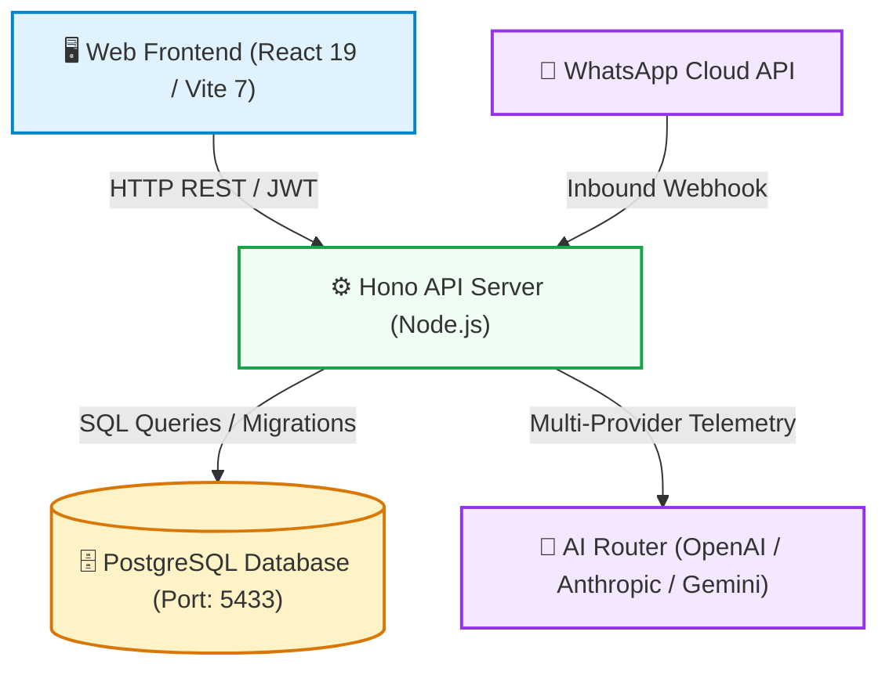

# Example: Sample Codebase Wiki Structure & Output

This document showcases a live example of a fully generated codebase wiki page for reference.

---

# Smart-Seller — Codebase Architecture & Technical Wiki

> **Autonomous Multi-Tenant E-Commerce AI Assistant & Store Management Platform**  
> *Version: 1.0.0* | *Last Synced: 2026-08-15*

---

## 🗺️ Master Wiki Navigation

| Section | Target Document | Description | Primary Audience |
|:---|:---|:---|:---|
| **01** | [Architecture Overview](./01-architecture-overview.md) | C4 Context/Container Topology, Monorepo Packages, Tech Stack | Architects & Leads |
| **02** | [Domain Models & Data](./02-domain-models-and-data.md) | Entity Relationship Diagrams (ERD), Schemas, State Machines | Backend & DB Engineers |
| **03** | [API & Interface Contracts](./03-api-and-contracts.md) | REST/RPC Catalog, Auth Guards, Payloads, Webhook Specs | Frontend, API & QA |
| **04** | [Features & Workflows](./04-features-and-workflows.md) | Business Domain Flows, Sequence Diagrams, Logic Rules | Fullstack Developers |
| **05** | [Infrastructure & DevOps](./05-infrastructure-and-devops.md) | Docker Services, CI/CD Pipelines, Environment Variables | DevOps & SREs |
| **06** | [Developer Onboarding](./06-developer-onboarding.md) | Local Dev Setup, Commands Cheat Sheet, Debugging, Conventions | New Engineers |
| **07** | [Architecture Decisions (ADRs)](./07-adrs-and-decisions.md) | Architectural Decision Records & Major System Tradeoffs | Engineering Team |

---

## 🏛️ High-Level System Architecture Map

---

## 📦 Monorepo Applications & Shared Modules

### Applications
| Package / App | Path | Description |
|:---|:---|:---|
| `apps/frontend` | `apps/frontend` | Standalone Web App (React 19 + Vite 7 + TanStack Router + Tailwind CSS v4) |
| `apps/api` | `apps/api` | Backend API Server (Hono.js + TypeScript) |

### Shared Packages & Domain Modules
| Package Name | Path | Description |
|:---|:---|:---|
| `@smart-seller/db` | `packages/db` | Centralized PostgreSQL database service and migrations |
| `@smart-seller/ai` | `packages/ai` | Unified AI Provider failover router and prompt guards |
| `@mod/users-management` | `packages/users-management` | Multi-tenant RBAC, authentication, and session tokens |

---

## 🔄 Real-time Codebase Sync Status

<!-- RECENT_SYNC_LOG_START -->
### 🕒 Last Sync Event: 2026-08-15 07:30:00 UTC
| Modified Source File | Impacted Wiki Section | Change Trigger |
|:---|:---|:---|
| `apps/api/src/routes/assistant.ts` | [03-api-and-contracts.md](./03-api-and-contracts.md) | AI Assistant route update |
| `packages/db/src/service.ts` | [02-domain-models-and-data.md](./02-domain-models-and-data.md) | PostgreSQL entity updates |
<!-- RECENT_SYNC_LOG_END -->
