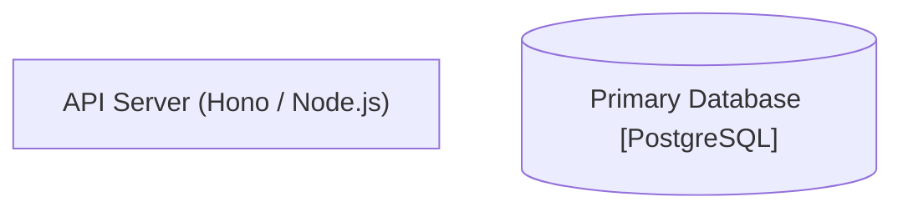
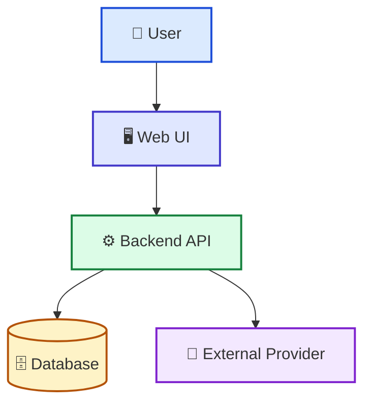
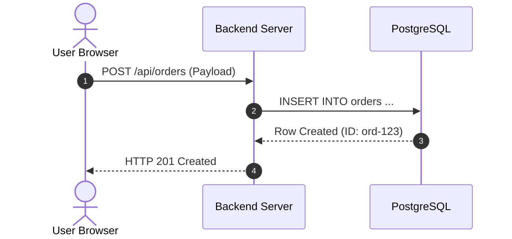

# Reference: C4 Architecture & Mermaid Diagram Guidelines

Guidelines for generating clean, robust, and accessible Mermaid diagrams within codebase wiki documents.

---

## 1. Node Label Escaping & Quoting Rules

> [!CAUTION]
> Special characters like `(`, `)`, `[`, `]`, `{`, `}`, `<`, `>`, and `"` inside Mermaid node labels WILL cause syntax errors if not strictly quoted.

**Correct Syntax:**


**Incorrect Syntax (Breaks Rendering):**
```text
graph TD
    API[API Server (Hono / Node.js)]  <-- Syntax Error!
    DB[(Primary Database [PostgreSQL])] <-- Syntax Error!
```

---

## 2. Standard Semantic Styling Classes (`classDef`)

Always use consistent color schemes across architecture diagrams:



---

## 3. Sequence Diagram Standards

1. Always enable auto-numbering: `autonumber`.
2. Define participants explicitly with clear, human-readable aliases.
3. Use solid arrows (`->>`) for synchronous requests and dashed arrows (`-->>`) for responses.


