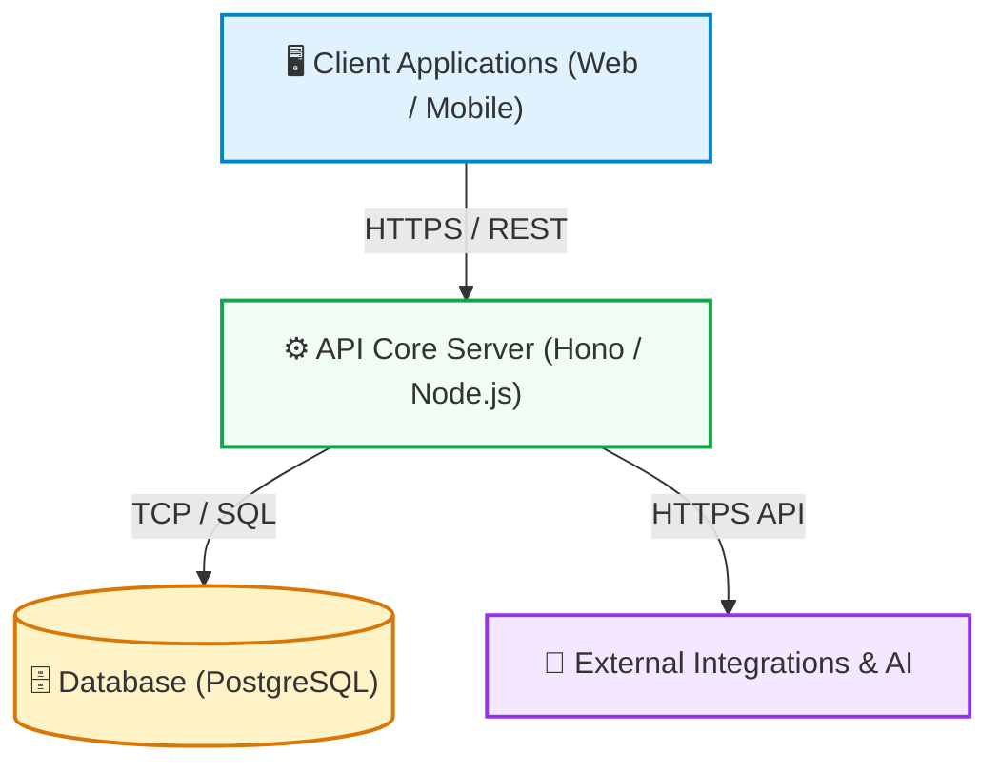

# {{PROJECT_NAME}} — Codebase Architecture & Technical Wiki

> **{{PROJECT_DESCRIPTION}}**  
> *Version: {{PROJECT_VERSION}}* | *Last Synced: {{CURRENT_DATE}}*

---

## 🗺️ Master Wiki Navigation

| Section | Target Document | Description | Primary Audience |
|:---|:---|:---|:---|
| **01** | [Architecture Overview](./01-architecture-overview.md) | C4 Context/Container Topology, Monorepo Packages, Tech Stack | Architects & Leads |
| **02** | [Domain Models & Data](./02-domain-models-and-data.md) | Entity Relationship Diagrams (ERD), Schemas, State Machines | Backend & DB Engineers |
| **03** | [API & Interface Contracts](./03-api-and-contracts.md) | REST/RPC Catalog, Auth Guards, Payloads, Webhook Specs | Frontend, API & QA |
| **04** | [Features & Workflows](./04-features-and-workflows.md) | Business Domain Flows, Sequence Diagrams, Logic Rules | Fullstack Developers |
| **05** | [Infrastructure & DevOps](./05-infrastructure-and-devops.md) | Docker Services, CI/CD Pipelines, Environment Variables | DevOps & SREs |
| **06** | [Developer Onboarding](./06-developer-onboarding.md) | Local Dev Setup, Commands Cheat Sheet, Debugging, Conventions | New Engineers |
| **07** | [Architecture Decisions (ADRs)](./07-adrs-and-decisions.md) | Architectural Decision Records & Major System Tradeoffs | Engineering Team |

---

## 🏛️ High-Level System Architecture Map

---

## 📦 Monorepo Applications & Shared Modules

### Applications
{{APPS_TABLE}}

### Shared Packages & Domain Modules
{{PACKAGES_TABLE}}

---

## 🔄 Real-time Codebase Sync Status

<!-- RECENT_SYNC_LOG_START -->
### 🕒 Last Sync Event: {{CURRENT_DATE}}
| Modified Source File | Impacted Wiki Section | Change Trigger |
|:---|:---|:---|
| *(Codebase Clean / Initial Scaffold)* | [All Wiki Docs](./00-index.md) | Initial Scaffold Generation |
<!-- RECENT_SYNC_LOG_END -->

---

> [!TIP]
> **Keep this Wiki automatically synchronized!**  
> Run `node .agents/skills/codebase-wiki-generator/scripts/watch-and-sync.js` in a background terminal, or install git commit hooks via `node .agents/skills/codebase-wiki-generator/scripts/setup-git-hooks.js`.
