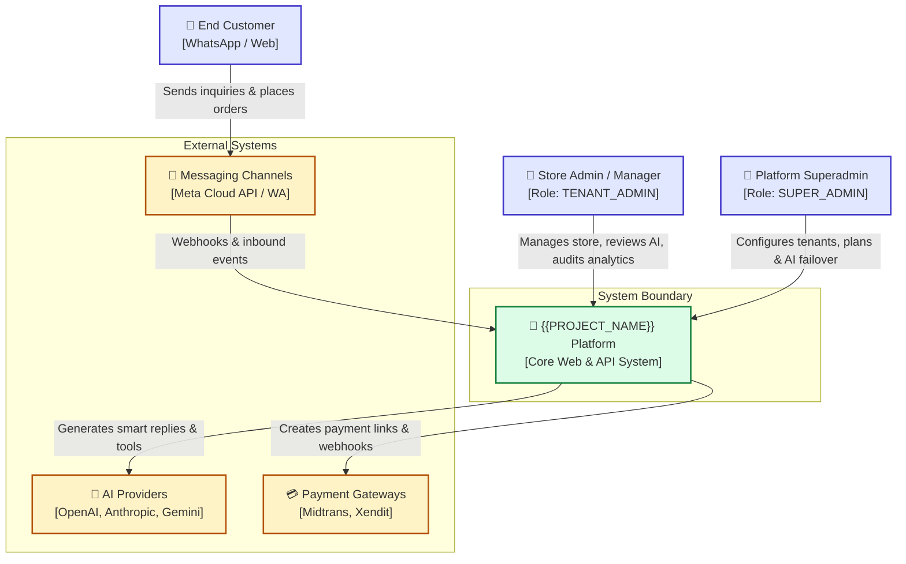
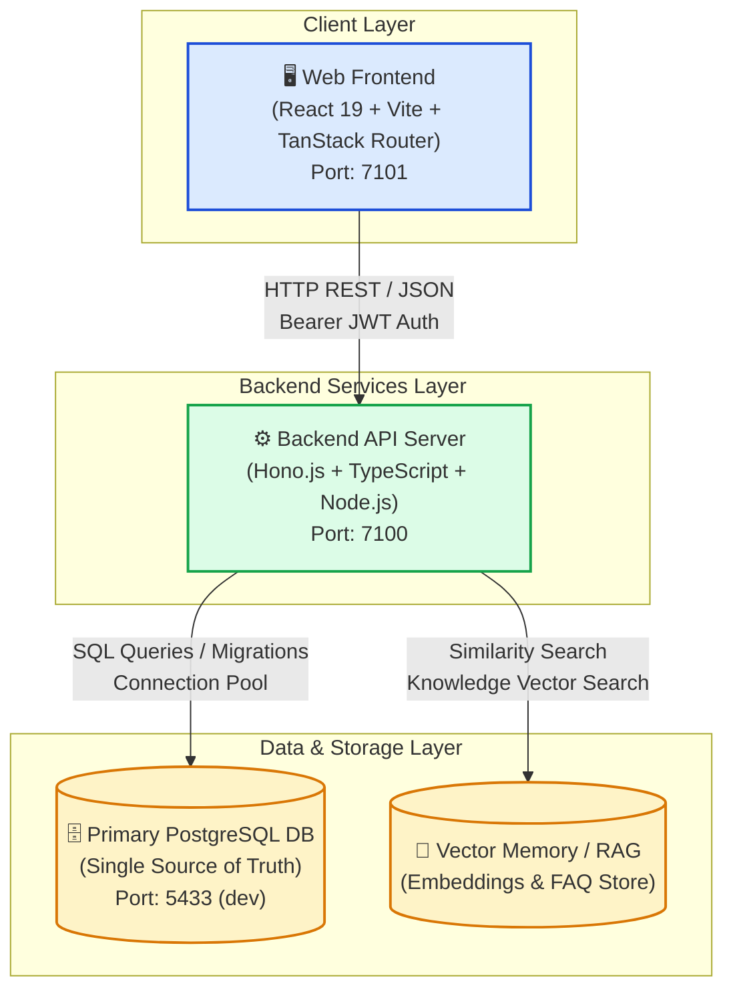

# 01. System Architecture & C4 Topology

> [!NOTE]
> This document details the high-level system architecture, C4 context and container diagrams, monorepo structure, and core technical design principles of **{{PROJECT_NAME}}**.

[⬅️ Back to Master Index](./00-index.md)

---

## 1. C4 Model — System Context (Level 1)

The Context Diagram illustrates the boundary of {{PROJECT_NAME}} and how external users and systems interact with it.

---

## 2. C4 Model — Container Architecture (Level 2)

The Container Diagram shows the high-level executable components, data stores, and communication protocols.

---

## 3. Technology Stack Matrix

| Layer / Concern | Technology Selection | Rationale & Tradeoffs |
|:---|:---|:---|
| **Web Frontend** | React 19, Vite 7, TanStack Router & Query v5 | Maximum performance, fine-grained routing, and optimistic UI mutations |
| **Styling & UI** | Tailwind CSS v4, Radix UI Primitives, Lucide Icons | Accessible, responsive, zero-runtime CSS footprint |
| **Backend API** | Hono.js on Node.js runtime | Ultra-lightweight, high throughput, TypeScript native |
| **Primary Database** | PostgreSQL (`DATABASE_URL`) | ACID compliance, robust multi-tenancy, relational integrity |
| **AI Integration** | Dynamic Multi-Provider Routing (OpenAI, Gemini, Anthropic) | Token telemetry, failover resilience, zero-vendor lock-in |
| **Security & Scanning** | File Scanner & Prompt Injection Sanitizer | Defense-in-depth against malicious uploads and prompt leaks |

---

## 4. Architectural & Design Principles

1. **PostgreSQL as Single Source of Truth**:  
   All tenant records, user permissions, AI configurations, conversations, and audit logs are stored centrally in PostgreSQL.
2. **Strict Multi-Tenant Segregation**:  
   Every tenant query is scoped by `tenant_id` at the database level with role-based access control (RBAC).
3. **Decoupled AI Tool Ecosystem**:  
   Store copilot capabilities are modularized into separate, pure-functional tools (`managePlans`, `manageTasks`, `manageOrders`, `shippingAssistant`, etc.).
4. **Resilient Fast-Fail & Fallback Routing**:  
   When AI keys are unconfigured or fail, background tasks seamlessly fall back to deterministic execution without blocking the user.
