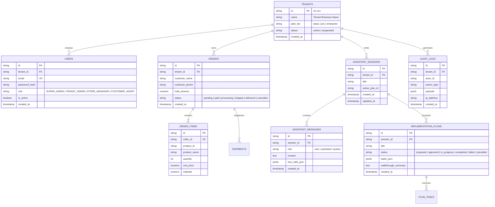
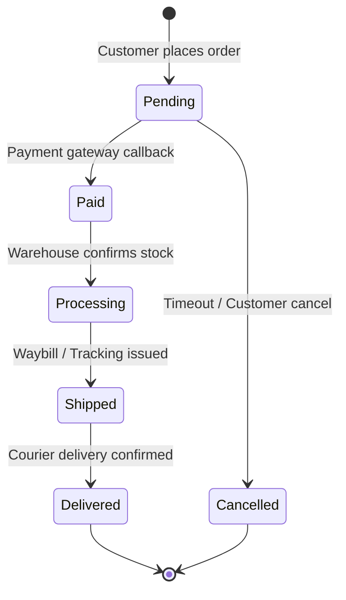
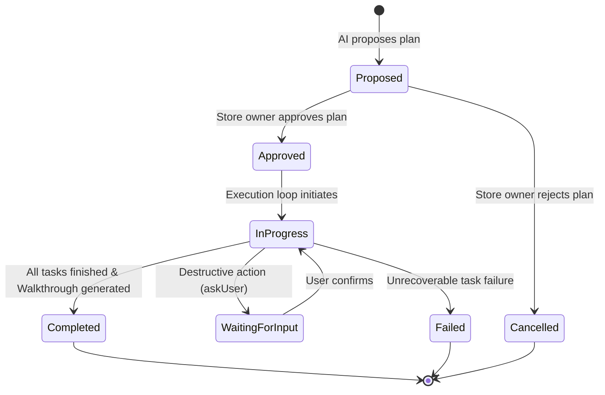

# 02. Domain Entities, Schemas & ERD

> [!NOTE]
> This document details the database architecture, Entity-Relationship Diagram (ERD), schema catalog, lifecycle state machines, and data retention policies.

[⬅️ Back to Master Index](./00-index.md)

---

## 1. Entity-Relationship Diagram (Mermaid ERD)



---

## 2. Core Entity Catalog

| Entity / Table Name | Primary Key | Foreign Keys | Business Responsibility | Indexing & Constraints |
|:---|:---|:---|:---|:---|
| `tenants` | `id` (string) | - | Root multi-tenancy boundary and billing tier | Index on `status`, Unique on `name` |
| `users` | `id` (string) | `tenant_id` $\rightarrow$ `tenants.id` | User accounts, credentials, and RBAC roles | Unique on `(tenant_id, email)`, Index on `role` |
| `orders` | `id` (string) | `tenant_id` $\rightarrow$ `tenants.id` | Transaction records, totals, and fulfillment state | B-Tree on `(tenant_id, created_at)`, Index on `status` |
| `order_items` | `id` (string) | `order_id` $\rightarrow$ `orders.id` | Line items and pricing snapshot per order | Index on `order_id` |
| `assistant_sessions` | `id` (string) | `tenant_id` $\rightarrow$ `tenants.id` | AI Store Copilot conversation threads | Index on `(tenant_id, updated_at DESC)` |
| `assistant_messages` | `id` (string) | `session_id` $\rightarrow$ `assistant_sessions.id` | Chat messages with structured tool call payloads | Index on `(session_id, created_at ASC)` |
| `audit_logs` | `id` (string) | `tenant_id` $\rightarrow$ `tenants.id` | Compliance, security trace & modification audit trail | Composite Index on `(tenant_id, created_at DESC)` |

---

## 3. State Machines & Status Transitions

### A. Order Fulfillment State Machine


### B. AI Implementation Plan Execution State Machine


---

## 4. Migrations & Database Management

Migrations are stored in `packages/db/migrations` or managed via the backend database service.

```powershell
# Run database migrations
pnpm --filter @smart-seller/db migrate

# Seed development sample data
pnpm --filter @smart-seller/db seed
```
