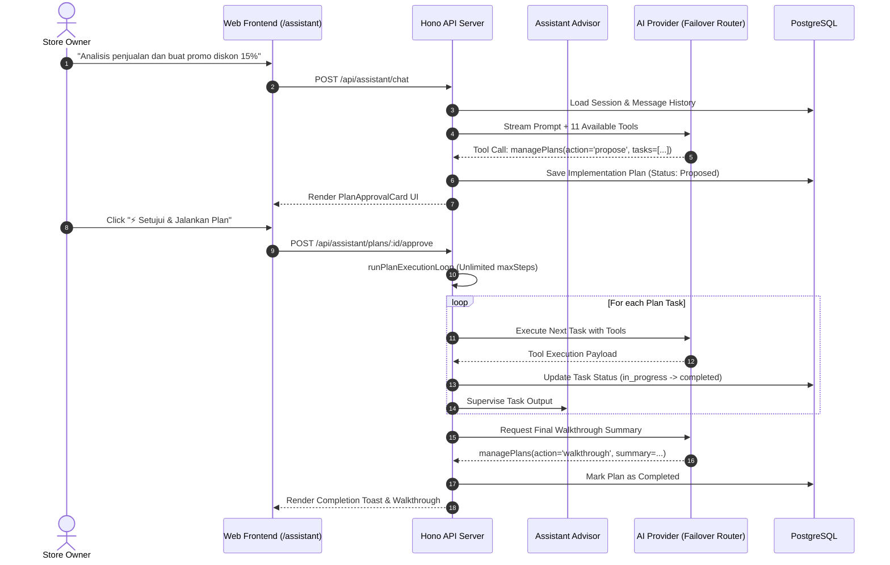
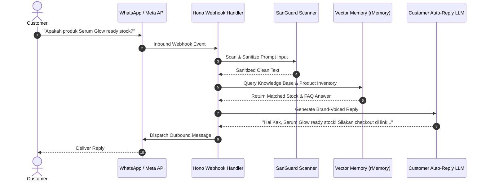

# 04. Core Business Features & Workflows

> [!NOTE]
> This document details the end-to-end operational workflows, sequence diagrams, state transitions, and business logic rules across {{PROJECT_NAME}}.

[⬅️ Back to Master Index](./00-index.md)

---

## 1. Domain Feature Map

```mermaid
graph TD
    classDef owner fill:#e0f2fe,stroke:#0284c7,stroke-width:2px;
    classDef agent fill:#f0fdf4,stroke:#16a34a,stroke-width:2px;
    classDef system fill:#fef3c7,stroke:#d97706,stroke-width:2px;

    subgraph Store Owner Copilot Layer (/assistant)
        DOC_SCAN["OCR & File Scanner<br/>(PDF, Invoices, CSV)"]:::owner
        PLAN_EXEC["Dynamic Plan Execution<br/>(11 Unified Tools)"]:::owner
        SALES_AUDIT["Sales & Inventory Analytics"]:::owner
    end

    subgraph Customer Agent Auto-Reply Layer (/agent, /inbox)
        INBOX_INGEST["WhatsApp / Channel Ingest"]:::agent
        RAG_MEMORY["Vector RAG / FAQ Match"]:::agent
        AUTO_DISPATCH["Response Dispatcher"]:::agent
    end

    subgraph Core Platform Operations
        ORDER_FLOW["Order & Payment Processing"]:::system
        TENANT_SYNC["Multi-Tenant Sync & Provisioning"]:::system
    end

    DOC_SCAN --> PLAN_EXEC
    PLAN_EXEC --> RAG_MEMORY
    INBOX_INGEST --> RAG_MEMORY
    RAG_MEMORY --> AUTO_DISPATCH
    AUTO_DISPATCH --> ORDER_FLOW
```

---

## 2. Feature Deep-Dives & Sequence Flows

### A. Store Owner Copilot & Dynamic Plan Execution

The Store Copilot enables store owners to execute complex operational workflows using 11 unified tools (`managePlans`, `manageTasks`, `manageOrders`, `shippingAssistant`, etc.).



---

### B. Customer Messaging Ingestion & Auto-Reply Flow



---

## 3. Business Edge Cases & Failure Recovery

| Edge Case / Scenario | System Behavior & Mitigation |
|:---|:---|
| **AI Provider Outage (OpenAI 500 / 429)** | AI Failover Router switches dynamically to Anthropic or Gemini. If all unconfigured, falls back to deterministic execution (`executeTaskDirectly`). |
| **Destructive Store Actions (Delete/Cancel)** | AI Copilot is strictly prohibited from direct execution. Must trigger `askUser` confirmation prompt first. |
| **Malicious File Upload** | `SanCleanFiles` scanner neutralizes macros, scripts, and suspicious mime-types before OCR parsing. |
| **High Concurrency Rate Limits** | Token telemetry throttles outbound requests using sliding window rate limiter with exponential backoff. |
