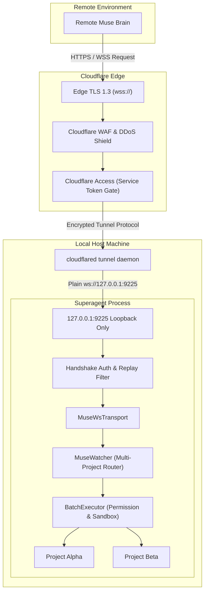

# Muse Cloudflare Tunnel and WebSocket Integration Implementation Plan

> **For Claude / Agent:** Use `${SUPERPOWERS_SKILLS_ROOT}/skills/collaboration/executing-plans/SKILL.md` to implement this plan task-by-task.

**Goal:** Enable Superagent's Muse remote cognitive brain to communicate over secure WebSocket (`wss://`) exposed via Cloudflare Tunnel (`cloudflared`) with defense-in-depth authentication, replay protection, heartbeat monitoring, and full multi-project watch mode support.

**Architecture:** A pluggable `RemoteTransport` interface decouples `MuseWatcher` from Telegram, allowing seamless switching between Telegram and WebSocket transports. In WebSocket mode, Superagent runs a local `MuseWsServer` bound strictly to `127.0.0.1` behind Cloudflare Tunnel (or optionally runs as `MuseWsClient` connecting to an external hub). Inbound connections are verified across five security gates: Cloudflare Access Service Tokens, timing-safe pre-shared bearer handshake, monotonic replay filtering, singleton session locking, and out-of-bounds workspace sandbox controls.

**Tech Stack:** Node.js, TypeScript, `ws` (WebSocket server & client), Node `crypto` (timing-safe comparisons, random tokens, HMAC/hashing), Vitest (unit tests), Cloudflare Tunnel (`cloudflared`).

---

## Proposed Changes

### Core Configuration & Transport Abstraction
- Modify `package.json` to move `ws` to direct runtime `dependencies`.
- Update `src/core/remoteAgent/config.ts` to add WebSocket configurations (`transport`, `wsPort`, `wsHost`, `wsToken`, `wsPath`, `cfAccessClientId`, `cfAccessClientSecret`, `wsMode`, `wsRemoteUrl`), token generation, and secure masking.
- Create `src/core/remoteAgent/transport.ts` defining the `RemoteTransport` interface (`sendEnvelope`, `onEnvelope`, `start`, `stop`, `isConnected`, `getTransportInfo`).
- Update `src/core/remoteAgent/museClient.ts` to implement `RemoteTransport` for Telegram.

### Security & Authentication Module
- Create `src/core/remoteAgent/museWsAuth.ts`:
  - Timing-safe token comparison using `crypto.timingSafeEqual`.
  - Cloudflare Access Service Token verification (`CF-Access-Client-Id` and `CF-Access-Client-Secret`).
  - Monotonic replay protection and timestamp TTL window (rejecting frames older than 60s or with reused nonces).
  - Secure random token generator (`generateSecureWsToken()`).

### WebSocket Transport Implementation
- Create `src/core/remoteAgent/museWsTransport.ts`:
  - `MuseWsServerTransport`: Local WebSocket server bound to `127.0.0.1:9225`, handling HTTP upgrade auth, handshake timeout (5s), singleton connection enforcement, max payload limit (10MB), and ping-pong heartbeat (30s).
  - `MuseWsClientTransport`: Outbound client connecting to a remote `wss://` endpoint with Cloudflare Access headers and authentication handshake.
  - Automatic task/batch cancellation and cleanup upon connection drop.

### Daemon & CLI Integration
- Update `src/core/remoteAgent/museWatcher.ts` to accept `RemoteTransport` and dynamically select between Telegram and WebSocket transports while retaining all multi-project watch and sandbox features.
- Update `src/core/remoteAgent/museCli.ts` to support `--ws`, `--ws-port`, `--ws-token`, `--ws-cf-id`, `--ws-cf-secret`, `--ws-client` flags, and add `/muse tunnel` helper to generate `cloudflared` configuration snippets.
- Update `src/core/commands/museCommand.ts` to add WebSocket configuration options to the interactive wizard.
- Update `src/cli.tsx` to pass WebSocket flags to the CLI dispatcher.

### Tasks Checklist
- [ ] Task 1: Add ws to dependencies in `package.json` and expand `RemoteAgentConfig` in `src/core/remoteAgent/config.ts`
- [ ] Task 2: Implement timing-safe auth and replay protection in `src/core/remoteAgent/museWsAuth.ts`
- [ ] Task 3: Define `RemoteTransport` interface in `src/core/remoteAgent/transport.ts` and wrap Telegram transport
- [ ] Task 4: Implement secure WebSocket transport in `src/core/remoteAgent/museWsTransport.ts`
- [ ] Task 5: Refactor `MuseWatcher` in `src/core/remoteAgent/museWatcher.ts` to support pluggable transports
- [ ] Task 6: Add CLI commands, flags, and `cloudflared` onboarding helper in `museCli.ts` and `museCommand.ts`
- [ ] Task 7: Author unit tests in `tests/museWebSocketTransport.test.ts`
- [ ] Task 8: Run unit test suite and verify build with `npm test` and `npm run build`
- [ ] Task 9: Bump package version in `package.json`, update `CHANGELOG.md`, and provide project completion conclusion

---

## Architecture

### System Data Flow



### 5-Layer Defense-in-Depth Security Model

| Layer | Component | Defense Mechanism | Risk Mitigated |
|---|---|---|---|
| **Layer 1** | Edge & Network | Cloudflare Access Service Tokens (`CF-Access-Client-Id` & `Secret`), Cloudflare WAF, TLS 1.3, Local loopback bind (`127.0.0.1`) | Prevents public internet exposure, port scanning, raw DDoS, and MITM snooping. |
| **Layer 2** | Connection Handshake | Timing-safe Bearer token comparison (`crypto.timingSafeEqual`) via upgrade header or post-connect handshake within 5s timeout | Prevents unauthorized socket connections and timing attacks. |
| **Layer 3** | Message Frame Integrity | Monotonic nonce tracking and timestamp TTL window (max drift 60s) on all incoming protocol envelopes | Prevents packet replay attacks and duplicate batch executions. |
| **Layer 4** | Session Lifecycle | Singleton connection lock (max 1 active Muse brain connection), 30s ping-pong keepalive, auto-cancel active batches on disconnect | Prevents connection hijacking, phantom zombie batches, and split-brain states. |
| **Layer 5** | Sandbox & Permissions | Multi-workspace boundary checking (`isMuseOutOfBounds`), dangerous command interception, human operator permission confirmation prompts | Protects local host filesystem and sensitive credentials from unauthorized modification. |

### Envelope Extension for WebSocket

While retaining backward compatibility with the existing v: 1 envelopes (`task_request`, `task_batch`, `task_result`, `task_done`, `chat`, `task_cancel`), WebSocket envelopes include optional security metadata:

```json
{
  "v": 1,
  "kind": "task_batch",
  "id": "batch_9876",
  "task_id": "task_1234",
  "ts": 1775138400000,
  "nonce": "a7b3c9d2-e5f8-410a-bc91-8899aabbccdd",
  "workspace": "/path/to/project-alpha",
  "calls": [
    {
      "id": "c1",
      "tool": "run_command",
      "args": { "command": "git status" }
    }
  ]
}
```

---

## Verification Plan

### Automated Tests
- Run unit test suite: `npx vitest run tests/museWebSocketTransport.test.ts`
  - Test 1: Configuration validation, default values, token masking, and workspace path resolution.
  - Test 2: WebSocket handshake authentication with valid token (success) and invalid token (immediate termination).
  - Test 3: Cloudflare Access header verification (`CF-Access-Client-Id` and `CF-Access-Client-Secret`).
  - Test 4: Replay protection (rejecting expired timestamps or duplicated nonces).
  - Test 5: Full envelope round-trip (`task_batch` executed locally and `task_result` emitted back over WebSocket).
  - Test 6: Multi-project workspace dispatching over WebSocket (`workspace` argument routing).
  - Test 7: Singleton connection enforcement (rejecting or evicting competing secondary connections).
  - Test 8: Heartbeat timeout and disconnection triggering batch abort.
- Run full regression test suite: `bun test` or `npx vitest run` (ensure all existing 96 tests continue passing).
- Run build verification: `bun run build` or `npm run build` (tsc clean with zero TypeScript compilation errors).

### Manual Verification
- Test local WebSocket server launch via CLI: `superagent --muse --ws --ws-port 9225`
- Connect test WebSocket client with valid and invalid tokens to confirm terminal logs and handshake behavior.
- Run `/muse tunnel` to verify generated `cloudflared` configuration commands and documentation.
- Test `/muse config` interactive prompts to verify WebSocket parameters can be viewed, modified, and saved cleanly.
