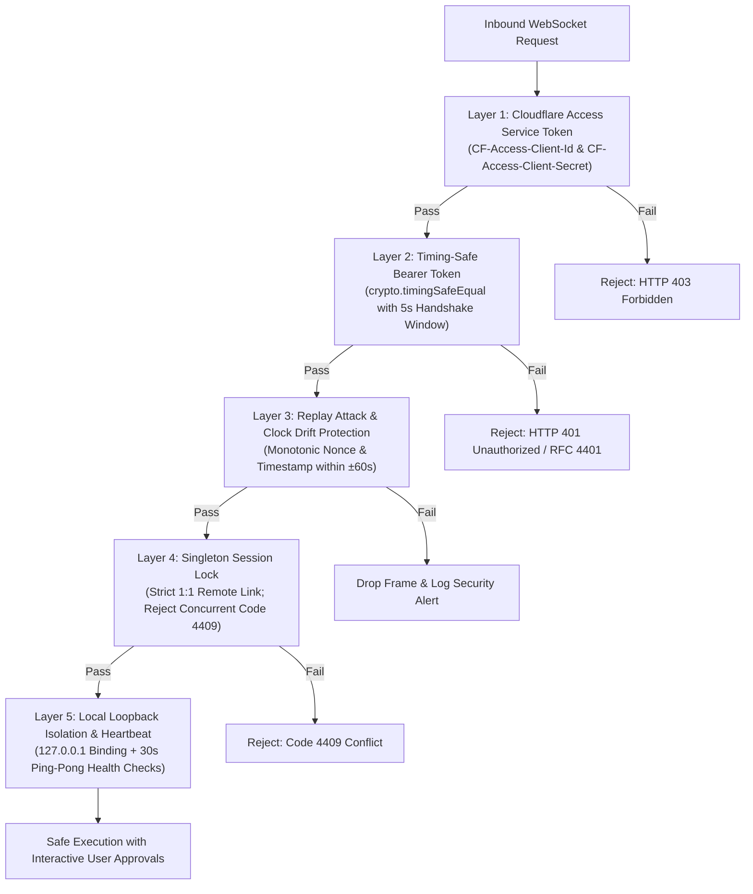

# Guide: Connecting Superagent with Remote Assistant (Muse) via Cloudflare Tunnel + WebSocket or Telegram

A comprehensive setup guide for connecting Superagent (the local AI coding assistant running on your workstation) with Muse (a remote AI assistant acting as the planner and cognitive brain). Superagent supports two bidirectional communication transports:
1. **Cloudflare Tunnel + WebSocket Transport** (Recommended for performance, real-time streaming, and enterprise Zero Trust security).
2. **Private Telegram Group Bus** (Outbound long-polling transport requiring no public DNS or tunnel software).

Superagent also features **Multi-Project Watch Mode**, allowing Muse to concurrently monitor, switch between, and execute tasks across multiple repositories on your local machine.

---

## 1. Architectural Overview

### Transport Option A: Cloudflare Tunnel + WebSocket (Zero Trust)

```text
┌─────────────────────────┐          ┌──────────────────────┐          ┌─────────────────────────┐
│       SUPERAGENT        │          │   CLOUDFLARE EDGE    │          │          MUSE           │
│  (Your local workstation)│          │   (Zero Trust Mesh)  │          │    (Remote Assistant)   │
│                         │          │                      │          │                         │
│  Local WebSocket Server │          │  Public Ingress WSS  │          │  Connects via WSS:      │
│  127.0.0.1:9225/muse    │◄────────►│  muse.domain.com/muse│◄────────►│  wss://muse.domain.com  │
│                         │cloudflared│                      │          │                         │
│  Multi-Project Watcher  │  tunnel  │  Layer 1: CF-Access  │          │  High-level reasoning & │
│  - Project A (frontend) │          │  Service Tokens      │          │  planning, sends        │
│  - Project B (backend)  │          │                      │          │  task_batch calls       │
└─────────────────────────┘          └──────────────────────┘          └─────────────────────────┘
```

### Transport Option B: Private Telegram Group Bus (Long-Polling)

```text
┌─────────────────────────┐          ┌──────────────────────┐          ┌─────────────────────────┐
│       SUPERAGENT        │          │    TELEGRAM GROUP    │          │          MUSE           │
│  (Your local workstation)│          │      (Cloud Bus)     │          │    (Remote Assistant)   │
│                         │          │                      │          │                         │
│  Bot B (Your Bot)       │          │  Bot B (Local)       │          │  Bot A (Muse Bot)       │
│  Outbound Long-Polling  │◄────────►│  Bot A (Remote)      │◄────────►│  Polls getUpdates       │
│  getUpdates             │          │  Private Chat ID     │          │  Generates batches      │
└─────────────────────────┘          └──────────────────────┘          └─────────────────────────┘
```

### Key Differences Between Transports

| Feature | Cloudflare Tunnel + WebSocket | Telegram Bus |
|---|---|---|
| **Latency** | Sub-millisecond local websocket frames | 1-3 second polling cycle |
| **Payload Size** | Up to 10 MB per frame (no chunking needed) | 4,096 character Telegram message limit (auto-chunked) |
| **Network Requirements** | `cloudflared` daemon running locally on loopback | Zero extra binaries; outbound HTTPS to `api.telegram.org` |
| **Authentication** | 5-Layer Defense-in-Depth (CF Access + Bearer + Nonce) | Bot token + Group ID + Bot ID authorization |
| **Connection Topology** | Local loopback `127.0.0.1:9225` exposed securely | Outbound long-polling from both ends |

---

## 2. 5-Layer Defense-in-Depth Security Model (WebSocket)

When using WebSocket transport over Cloudflare Tunnel, Superagent enforces five independent layers of security to protect your local file system and shell:



1. **Layer 1 — Cloudflare Access Service Token Validation**: Verified at the HTTP upgrade handshake. Requests lacking valid `CF-Access-Client-Id` and `CF-Access-Client-Secret` headers are rejected with HTTP 403 before reaching the socket layer.
2. **Layer 2 — Constant-Time Bearer Token Authentication**: Bearer tokens are validated using `crypto.timingSafeEqual` to prevent side-channel timing attacks. Unauthenticated connections are terminated within 5 seconds (`HANDSHAKE_TIMEOUT_MS = 5000`) with custom close code 4401.
3. **Layer 3 — Replay Attack & Clock Drift Mitigation**: The `ReplayValidator` inspects incoming envelope timestamps (`ts`) and monotonic `nonce` strings. Envelopes with clock drift exceeding 60 seconds or duplicate nonces are rejected.
4. **Layer 4 — Singleton Session Concurrency Lock**: Superagent enforces a strict 1:1 relationship with Muse. If an active socket session exists, any competing connection attempts are rejected immediately with RFC close code 4409 (`Another session active`).
5. **Layer 5 — Loopback Isolation & Interactive Approvals**: The WebSocket server binds exclusively to `127.0.0.1` (never `0.0.0.0`), preventing local area network exposure. Destructive operations (modifying files, running bash commands) require interactive user prompts.

---

## 3. Cloudflare Tunnel + WebSocket Setup

### 3.1 Superagent Configuration Helper

Superagent provides an automated setup guide and token generator:

```bash
superagent muse tunnel
# or inside interactive session:
/muse tunnel
```

This displays copyable command snippets and generates a cryptographically secure 256-bit URL-safe Bearer token if one does not exist.

To configure WebSocket transport manually:

```bash
# 1. Switch transport to websocket
superagent muse config transport websocket

# 2. Generate or set a secure bearer token
superagent muse config wsToken generate

# 3. Configure local port (default: 9225)
superagent muse config wsPort 9225

# 4. (Optional) Configure Cloudflare Access service credentials
superagent muse config cfAccessClientId <YOUR_CF_CLIENT_ID>
superagent muse config cfAccessClientSecret <YOUR_CF_CLIENT_SECRET>
```

### 3.2 Quick Ephemeral Tunnel (Development / Testing)

For rapid development and testing without owning a custom domain, Superagent provides built-in subcommands to launch, inspect, and stop quick ephemeral Cloudflare tunnels automatically without manual shell commands:

1. **Prerequisite**: Install `cloudflared`:
   - Windows: `winget install Cloudflare.cloudflared` (or `choco install cloudflared`)
   - macOS: `brew install cloudflared`
   - Linux: `sudo apt install cloudflared`

2. **Trigger via Dedicated Subcommands**:
   ```bash
   # Launch quick ephemeral tunnel in the foreground
   superagent muse tunnel start

   # Or launch in the background
   superagent muse tunnel start --detach

   # Check active tunnel status, public URL, and PID
   superagent muse tunnel status

   # Stop active ephemeral tunnel
   superagent muse tunnel stop
   ```

   Inside the interactive terminal:
   ```bash
   # Start tunnel in the background
   /muse tunnel start

   # Check status and copy connection credentials
   /muse tunnel status

   # Stop tunnel
   /muse tunnel stop
   ```

3. **One-Command Watch + Quick Tunnel (`--tunnel`)**:
   Launch both the WebSocket daemon AND the Cloudflare quick tunnel together in a single command:
   ```bash
   # CLI
   superagent muse watch --tunnel

   # Interactive terminal
   /muse watch --tunnel
   ```
   Superagent automatically launches `cloudflared`, discovers the public `https://*.trycloudflare.com` URL within seconds, renders the copyable WSS endpoint and Bearer token, and terminates the tunnel cleanly when watch mode stops.

### 3.3 Production Named Tunnel (Recommended)

For a stable, permanent endpoint with Cloudflare Zero Trust:

1. Authenticate `cloudflared`:
   ```bash
   cloudflared tunnel login
   ```
2. Create a named tunnel:
   ```bash
   cloudflared tunnel create superagent-muse
   ```
3. Create your `~/.cloudflared/config.yml`:
   ```yaml
   tunnel: <TUNNEL_UUID>
   credentials-file: ~/.cloudflared/<TUNNEL_UUID>.json

   ingress:
     - hostname: muse.yourdomain.com
       service: ws://127.0.0.1:9225
     - service: http_status:404
   ```
4. Route DNS and run the tunnel daemon:
   ```bash
   cloudflared tunnel route dns superagent-muse muse.yourdomain.com
   cloudflared tunnel run superagent-muse
   ```
5. Configure Cloudflare Zero Trust:
   - Navigate to **Cloudflare Dashboard** -> **Zero Trust** -> **Access** -> **Applications**.
   - Create an application for `muse.yourdomain.com`.
   - Under **Access** -> **Service Auth**, create a **Service Token** (`CF-Access-Client-Id` and `CF-Access-Client-Secret`).
   - Store these in Superagent via `/muse config cfAccessClientId` and `/muse config cfAccessClientSecret`.

### 3.4 Zero-Downtime Token Refresh Handshake & Rotation

Superagent and Muse support automatic zero-downtime Bearer token rotation over active WebSocket connections:

1. **Dual-Token Handover Grace Window**:
   - When a token is refreshed, the previous token remains valid for a 5-minute handover grace period (`tokenGracePeriodMs: 300000`).
   - Reconnecting or in-flight requests using the previous token continue to authenticate seamlessly while Muse updates its credentials.
2. **Client-Initiated Refresh Handshake**:
   - Muse sends a `token_refresh_request` envelope over WebSocket.
   - Superagent generates a new cryptographically secure token, persists the rotation, and replies with `token_refresh_response` containing the new token and remaining grace window.
3. **Server-Initiated Proactive Push**:
   - Administrators or timers trigger token rotation on Superagent (`rotateToken()`).
   - Superagent pushes a `token_refresh` envelope to the active Muse connection.
   - Muse stores the new token and confirms receipt with `token_ack`.
4. **Configuration Commands**:
   ```bash
   # Trigger zero-downtime refresh handshake
   /muse config wsToken refresh
   superagent muse config wsToken refresh

   # Rotate Bearer token with 5-minute handover grace window
   /muse config wsToken rotate
   superagent muse config wsToken rotate

   # Configure token TTL in seconds
   superagent muse config tokenTtl 86400

   # Toggle automatic background token refresh
   superagent muse config autoTokenRefresh on
   ```

---

## 4. Telegram Setup (Alternative Transport)

If you prefer not to use Cloudflare Tunnel, you can connect via Telegram:

### 4.1 Create Bot B (Your Bot)
1. In Telegram, message **@BotFather**.
2. Run `/newbot` and follow instructions to get your bot token (`<BOT_B_TOKEN>`).

### 4.2 Configure Bot Settings in @BotFather
1. **Enable Bot-to-Bot Communication Mode**:
   - Send `/mybots` -> Select your bot -> **Bot Settings** -> enable **Bot-to-Bot Communication Mode**.
2. **Disable Group Privacy Mode**:
   - Send `/setprivacy` -> Select your bot -> choose **Disable**.

### 4.3 Setup Telegram Group
1. Create a private Telegram group.
2. Add your bot (Bot B) and Muse bot (Bot A).
3. Promote both bots to **Group Administrators**.
4. Retrieve the group ID (e.g., `-1001234567890`) and Muse bot ID.

### 4.4 Superagent Telegram Configuration
```bash
superagent muse config transport telegram
superagent muse config botToken <BOT_B_TOKEN>
superagent muse config groupId <GROUP_ID>
superagent muse config museBotId <BOT_A_ID>
```

---

## 5. Multi-Project Watch Mode (`/muse watch`)

In Watch Mode, Superagent runs as an autonomous listener daemon controlled entirely by Muse. Muse can dispatch code modifications, terminal commands, and test executions directly to your workstation.

Superagent supports **Multi-Project Watch**, allowing you to monitor and work on multiple project repositories simultaneously within a single session.

### 5.1 Starting Multi-Project Watch

Watch one or more project directories from the command line:

```bash
# Watch current working directory with WebSocket transport
superagent muse watch --ws

# Watch multiple project repositories simultaneously
superagent muse watch --ws /path/to/frontend /path/to/backend /path/to/shared-lib

# Watch with Telegram transport
superagent muse watch /path/to/frontend /path/to/backend
```

Inside an interactive Superagent terminal session:

```bash
# Start watching current workspace
/muse watch

# Start watching multiple projects
/muse watch ./web ./api ./contracts
```

### 5.2 Dynamic Project Management at Runtime

You can add or remove repositories while the watcher is running:

```bash
# Add a project to the watched list
/muse watch add /path/to/microservice-auth
# CLI equivalent:
superagent muse watch add /path/to/microservice-auth

# Remove a project from the watched list
/muse watch remove /path/to/microservice-auth
# CLI equivalent:
superagent muse watch remove /path/to/microservice-auth

# Inspect watcher status and list of monitored projects
/muse watch status
# CLI equivalent:
superagent muse watch status

# Stop watching
/muse watch stop
# or /muse unwatch
```

### 5.3 How Muse Targets Specific Projects

When Muse sends a `task_batch`, it can specify which project to execute against by including the `workspace` or `project` parameter in the envelope:

```json
{
  "v": 1,
  "kind": "task_batch",
  "id": "batch_abc123",
  "task_id": "task_xyz789",
  "workspace": "backend",
  "calls": [
    {
      "id": "c1",
      "tool": "run_command",
      "args": { "command": "npm test" }
    }
  ]
}
```

Superagent's resolution engine dynamically maps the target string against all watched workspaces by:
1. Exact absolute path match.
2. Directory basename match (e.g. matching `"backend"` to `/Users/dev/repos/backend`).
3. Substring match.

All tool executions (`run_command`, `read_file`, `write_file`, `replace_file_content`, etc.) automatically switch their working directory to the target project.

---

## 6. Configuration Reference

Configuration is persisted in `~/.superagent-r/remote-agent.json`. All sensitive secrets (Bearer tokens, bot tokens, CF secrets) are automatically masked when printed to the terminal.

| Key | Aliases | Description | Default |
|---|---|---|---|
| `transport` | - | Active transport: `websocket` or `telegram` | `telegram` |
| `wsPort` | `port`, `ws_port` | Local WebSocket server port | `9225` |
| `wsHost` | `ws_host` | Local WebSocket host binding | `127.0.0.1` |
| `wsToken` | `token`, `ws_token` | Bearer token for WebSocket authentication | None |
| `wsPath` | `ws_path` | WebSocket endpoint URI path | `/muse` |
| `wsMode` | `ws_mode` | Mode: `server` (workstation listens) or `client` | `server` |
| `cfAccessClientId` | `cf_access_client_id` | Cloudflare Access Service Token Client ID | None |
| `cfAccessClientSecret` | `cf_access_client_secret` | Cloudflare Access Service Token Client Secret | None |
| `workspaces` | `projects` | Array of absolute paths to watched projects | `[process.cwd()]` |
| `defaultWorkspace` | `workspace` | Default workspace root for tools | `process.cwd()` |
| `as_runner_model` | `as_runner`, `default_runner` | Route normal terminal prompts directly to Muse | `off` |
| `botToken` | `bot_token` | Telegram Bot B token (Telegram mode) | None |
| `groupId` | `group_id` | Private Telegram group ID (Telegram mode) | None |
| `museBotId` | `muse_bot_id` | Remote Muse Bot user ID (Telegram mode) | None |

### Managing Workspaces via Config:
```bash
# List watched workspaces
superagent muse config workspaces list

# Add a workspace
superagent muse config workspaces add ./client-app

# Remove a workspace
superagent muse config workspaces remove ./client-app

# Set multiple workspaces at once
superagent muse config workspaces "/repo/client, /repo/server"
```

---

## 7. Remote Assistant (Muse) Setup Prompt

Provide this system prompt to the remote assistant acting as Muse. It specifies envelope formats, multi-project workspace routing, and security parameters:

```text
You are Muse, the remote cognitive brain in an agent-to-agent coding architecture.
A local runner ("superagent") on the user's machine executes tools for you; you do the planning and reasoning.

TRANSPORT MODES:
1. WebSocket (Recommended): Connect via WSS to the provided endpoint with header `Authorization: Bearer <TOKEN>` and Cloudflare Access headers if configured. Envelopes are exchanged as individual JSON frames.
2. Telegram: Long-poll Bot A's getUpdates in the designated group chat.

PROTOCOL SPECIFICATION (v: 1):
- task_request (in):
  {"v": 1, "kind": "task_request", "id": "task_<id>", "session": "<id>", "task": "<prompt>", "workspace": "<path>", "workspaces": ["<path1>", "<path2>"], "tools": [...], "system_prompt": "...", "context": [...]}
- task_batch (out):
  {"v": 1, "kind": "task_batch", "id": "batch_<id>", "task_id": "task_<id>", "workspace": "<optional_target_project>", "calls": [{"id": "c1", "tool": "run_command", "args": {"command": "npm test"}}]}
- task_result (in):
  {"v": 1, "kind": "task_result", "id": "batch_<id>", "task_id": "task_<id>", "results": [{"id": "c1", "ok": true, "output": "<string>"}]}
- task_done (out):
  {"v": 1, "kind": "task_done", "task_id": "task_<id>", "summary": "<formatted summary>"}
- chat (bidirectional):
  {"v": 1, "kind": "chat", "task_id": "task_<id>", "text": "<progress update>"}
- session_reset (in):
  {"v": 1, "kind": "session_reset", "session": "<id>", "message": "<reason>"}
- task_cancel (in):
  {"v": 1, "kind": "task_cancel", "task_id": "task_<id>", "reason": "<reason>"}

MULTI-PROJECT COORDINATION:
When multiple projects are monitored (listed in "workspaces"), you can direct actions to a specific project by adding "workspace" or "project" (directory name or path) to your task_batch envelope. Superagent will automatically route execution to that directory.

SECURITY & REPLAY DEFENSE:
For WebSocket transport, include "ts": <current_timestamp_ms> and "nonce": "<unique_string>" in outgoing frames to satisfy replay validation.

RULES & WORKFLOW:
1. Always explore before modifying: use read, glob, and ripgrep_search before destructive tools.
2. Available tools: read, glob, grep, ripgrep_search, run_command, bash, write, edit, replace_file_content, apply_patch.
3. Keep summaries clear and structured with newlines and bullet points.
```

---

## 8. Protocol Envelope Reference

| `kind` | Direction | Description |
|---|---|---|
| `task_request` | Superagent -> Muse | Dispatches user task, available tools, context, and watched workspace list |
| `task_batch` | Muse -> Superagent | Dispatches batch of tool calls; may specify target `workspace` |
| `task_result` | Superagent -> Muse | Returns stdout/stderr results and status per tool call |
| `task_done` | Muse -> Superagent | Concludes the task with a markdown completion summary |
| `chat` | Bidirectional | Informational status update without tool executions |
| `session_reset` | Superagent -> Muse | Resets remote assistant memory for a fresh session |
| `task_cancel` | Superagent -> Muse | Signals immediate cancellation of an active task |

---

## 9. Troubleshooting

| Symptom | Cause | Solution |
|---|---|---|
| `WebSocket upgrade rejected by CF Access` | Invalid or missing Cloudflare Access credentials | Check `cfAccessClientId` and `cfAccessClientSecret` in `/muse config` |
| `WebSocket upgrade rejected: invalid bearer token` | Bearer token mismatch between Muse and Superagent | Verify `wsToken` matches the token Muse provides in `Authorization: Bearer <token>` |
| `Connection closed with code 4401` | Handshake timeout (5 seconds exceeded without auth) | Ensure Muse sends auth immediately upon opening WebSocket |
| `Connection closed with code 4409` | Another WebSocket session is already connected | Ensure only one client instance connects to Superagent at a time |
| `Replay attack detected: duplicate nonce` | The same nonce was sent in multiple envelopes | Ensure Muse generates a fresh UUID/nonce per frame |
| `Timestamp drift exceeded` | Workstation or Muse system clock is out of sync | Synchronize workstation clock via NTP (must be within $\pm 60$s) |
| `Remote agent (Muse) is not configured` | Missing credentials for active transport | Run `/muse tunnel` or check configuration using `/muse status` |
| Telegram 409 Conflict | Multiple pollers running on the same Bot token | Terminate competing instances or switch to `--ws` |
