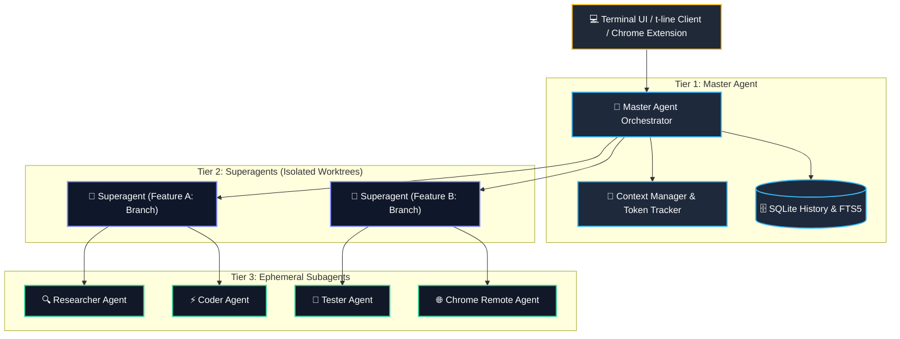

# Superagent Technical Architecture Wiki

Welcome to the comprehensive technical architecture wiki and developer documentation for **Superagent**.

Superagent is an interactive, terminal-based AI coding assistant featuring a cyberpunk style terminal UI, real-time context token tracking, and a 3-tier multi-agent orchestration system (Master Agent $\rightarrow$ Superagent $\rightarrow$ Subagent). It seamlessly bridges local development with desktop clients ([t-line](file:///d:/backup%20from%20pc%20asus/Documents%20Development/t-line)) and remote browser automation via lightweight Chrome extensions.

---

## Architecture Quick Map

---

## Wiki Chapters

| Chapter | File | Core Content |
|---|---|---|
| **00** | [00-index.md](file:///d:/backup%20from%20pc%20asus/Documents%20Development/superagent/docs/wiki/00-index.md) | Table of contents, tech stack badges, system map, and key principles |
| **01** | [01-architecture-overview.md](file:///d:/backup%20from%20pc%20asus/Documents%20Development/superagent/docs/wiki/01-architecture-overview.md) | 3-tier multi-agent hierarchy, C4 context & container diagrams, execution loops, client bridge modes |
| **02** | [02-domain-models-and-data.md](file:///d:/backup%20from%20pc%20asus/Documents%20Development/superagent/docs/wiki/02-domain-models-and-data.md) | SQLite schema (`history.db`), `model-config.json` schema, context & token tracking models, state machines |
| **03** | [03-api-and-contracts.md](file:///d:/backup%20from%20pc%20asus/Documents%20Development/superagent/docs/wiki/03-api-and-contracts.md) | CLI flags, slash commands, tool interface definitions, WebSocket bridge (port 9223), desktop bridge |
| **04** | [04-features-and-workflows.md](file:///d:/backup%20from%20pc%20asus/Documents%20Development/superagent/docs/wiki/04-features-and-workflows.md) | Orchestration lifecycles, worktree branching & merging, context compaction, browser automation |
| **05** | [05-infrastructure-and-devops.md](file:///d:/backup%20from%20pc%20asus/Documents%20Development/superagent/docs/wiki/05-infrastructure-and-devops.md) | Node/Bun runtime, TypeScript build pipeline, ~/.superagent-r/ storage layout, logging, error handling |
| **06** | [06-developer-onboarding.md](file:///d:/backup%20from%20pc%20asus/Documents%20Development/superagent/docs/wiki/06-developer-onboarding.md) | Setup instructions, development commands, testing guidelines, prompt authoring rules (Concepts A, B, C) |
| **07** | [07-adrs-and-decisions.md](file:///d:/backup%20from%20pc%20asus/Documents%20Development/superagent/docs/wiki/07-adrs-and-decisions.md) | Architecture Decision Records (ADRs) on multi-tier isolation, SQLite transcripts, JSON config, and WebSockets |

---

## Technology Stack

| Layer | Technology | Key Details |
|---|---|---|
| **Runtime & Execution** | Node.js (v20+ / v22+) & Bun | High-performance CLI runtime, TypeScript execution with `tsx` |
| **Terminal UI Framework** | React 18 & Ink | Cyberpunk terminal styling, ANSI styling, interactive widgets |
| **AI SDK & Model Providers** | Vercel AI SDK (`ai`), `@ai-sdk/*` | Multi-provider support: Anthropic Claude, Google Gemini, OpenAI, OpenRouter, DeepSeek, Ollama, Custom API |
| **Tokenization & Context** | `tiktoken`, `@anthropic-ai/tokenizer` | Model-specific context window tracking, compaction strategies, semantic analysis |
| **Storage & Persistence** | SQLite (`better-sqlite3` / raw SQL) | `~/.superagent-r/history.db` single source of truth, FTS5 full-text transcript search |
| **Configuration** | JSON-only (`model-config.json`) | Zero `process.env` pollution, profile switching, tiered model assignments |
| **Process & Worktrees** | Execa & Git Worktrees | Isolated per-feature branches under `~/.superagent-r/worktrees/` |
| **Remote Browser Bridge** | WebSocket (`ws`) | Port 9223 serverless bridge connecting CLI with Chrome extension |
| **Testing** | Vitest | Unit, integration, and anti-regression testing suite in `tests/` |

---

## Core Design Principles

1. **Strict 3-Tier Multi-Agent Separation**: Master Agent plans and orchestrates without directly editing code; Superagents execute feature development in isolated Git worktrees; Subagents perform atomic, ephemeral tasks.
2. **Zero `process.env` Dependency**: All configurations, API keys, presets, and tier models reside exclusively in `~/.superagent-r/model-config.json`.
3. **SQLite Single Source of Truth**: Chat transcripts, messages, and session metadata are stored and searched in SQLite (`history.db`) with FTS5. The historical `.json` files are 0-byte structural identifiers.
4. **Dynamic Context Engine**: Active token tracking prevents context window overflows through predictive summarization, pinning preservation, and semantic pruning.
5. **English-Only Standard**: All user-facing text, UI labels, log entries, comments, documentation, and prompt strings are strictly written in English.

## 🔄 Real-time Codebase Sync Status

<!-- RECENT_SYNC_LOG_START -->
### 🕒 Last Sync Event: 2026-09-04 13:00:33 UTC (Multi-Workspace: superagent, t-line)
| Modified Source File | Impacted Wiki Section | Change Trigger |
|:---|:---|:---|
| *(All Workspaces Clean / No uncommitted changes)* | [All Wiki Docs](./00-index.md) | Routine Verification Sync |
<!-- RECENT_SYNC_LOG_END -->
