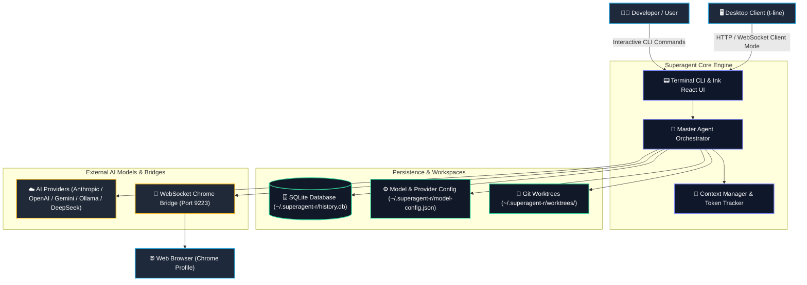
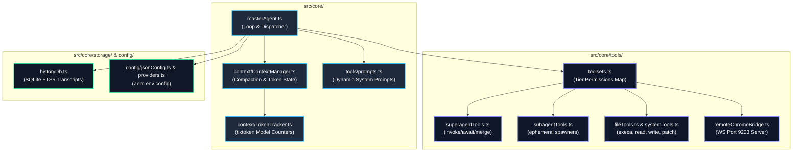

# 01. Architecture Overview

Superagent is designed around a multi-tier agent architecture, strict filesystem isolation, model-agnostic provider abstractions, and an interactive cyberpunk terminal user interface.

---

## 1. 3-Tier Multi-Agent Hierarchy

When running in multi-agent mode (`superagent --multi`), the system distributes responsibilities across three distinct tiers:

```
Master Agent  (Orchestrator & Strategy Engine)
  └── Superagent  (Per-Feature Developer, Isolated in Git Worktree)
        └── Subagent  (Atomic & Ephemeral Worker: Researcher, Coder, Reviewer, Tester, Chrome-Agent)
```

### Tier Responsibilities and Toolset Mapping

| Tier | Primary Role | Isolation Scope | Toolset (`src/core/tools/toolsets.ts`) |
|---|---|---|---|
| **Master Agent** | Orchestration, high-level planning, worktree lifecycle, progress monitoring, and branch merging. Cannot modify code files directly. | Main Repository Root | `invokeSuperagentTool`, `awaitSuperagentsTool`, `mergeSuperagentsTool`, `manageSuperagentsTool`, `manageSubagentsTool`, `gitWorktreeTool` |
| **Superagent** | Feature-level implementation, multi-step code refactoring, test execution, subagent dispatching, and branch committing. | Isolated Git Worktree (`~/.superagent-r/worktrees/<name>`) | Shell Tools + File Tools + `invokeSubagentTool`, `manageSubagentsTool`, `gitWorktreeTool` |
| **Subagent** | Ephemeral, specialized atomic tasks (researching codebase, writing targeted patches, code review, test verification, browser automation). | Current Parent Worktree (Ephemeral) | Targeted tools based on subagent type (e.g. `researcher`, `coder`, `reviewer`, `software-tester`, `chrome-agent`) |

---

## 2. C4 Architecture Diagrams

### C4 Level 1: System Context Diagram



### C4 Level 2: Container & Subsystem Architecture



---

## 3. Core Execution Lifecycle

1. **Initialization & Configuration Loading**:
   - `src/cli.tsx` bootstraps the application and reads configuration directly from `~/.superagent-r/model-config.json` via `getEffectiveMasterModel()` and `getConfiguredProviders()`.
   - SQLite connection to `~/.superagent-r/history.db` initializes tables (`sessions`, `messages`, `messages_fts`, `artifacts`).
2. **Context Engine Initialization**:
   - `ContextManager` binds with the chosen model tokenizer (`tiktoken` for OpenAI/Gemini/Anthropic equivalents).
   - Dynamic prompt generation builds the tier-specific instructions from `src/core/tools/prompts.ts`.
3. **Execution Loop (`masterAgent.ts`)**:
   - The user query is recorded to SQLite history.
   - Master Agent constructs the request, streams LLM output, and evaluates tool calls.
   - When feature work is required, Master Agent invokes `invokeSuperagentTool` to spin up a git worktree and branch.
   - Superagents work within their dedicated worktrees, utilizing subagents for atomic tasks.
   - Master Agent merges completed branches back to the main branch via `mergeSuperagentsTool`.
4. **Context Compaction & Token Maintenance**:
   - Before each iteration, `ContextManager` checks token consumption against the model limit.
   - If threshold is exceeded, pluggable compaction strategies (`SummarizationStrategy`, `PinningStrategy`, `PruningStrategy`) condense the transcript without data loss.

---

## 4. Worktree Isolation System

To guarantee that concurrent feature development does not cause git branch pollution or file race conditions:
- Each Superagent receives an isolated directory: `~/.superagent-r/worktrees/<feature-name>/`.
- A dedicated git branch (e.g. `feature/<feature-name>`) is created automatically.
- All file reads, writes, and test commands executed by the Superagent and its subagents occur inside this isolated worktree.
- Upon successful feature completion and verification, the Master Agent issues a merge operation back into the target branch.

---

## 5. Client Bridge Modes

Superagent supports multiple external integration modes:
1. **Desktop Client Bridge (`t-line`)**:
   - Superagent runs in server mode: `superagent --server 3000 --client-mode tline`.
   - Desktop frontend connects via HTTP/WebSocket protocol, rendering UI with terminal-grade performance.
2. **Remote Chrome Extension Bridge (`chrome-extension-remote`)**:
   - Serverless WebSocket server auto-binds on `ws://127.0.0.1:9223`.
   - Lightweight Chrome extension connects from any browser profile, enabling automated tab management, DOM inspection, screenshot capture, and navigation without launching bulky Puppeteer/Playwright instances.
