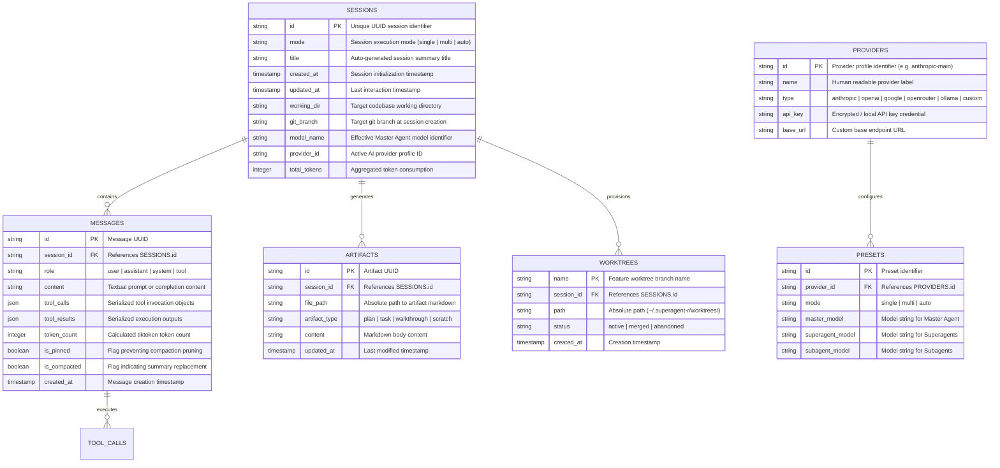
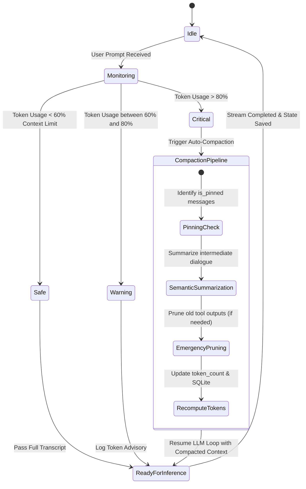

# 02. Domain Models & Data Architecture

This document describes the data persistence models, SQLite database schemas, configuration schemas, and context window state machines in Superagent.

---

## 1. Entity-Relationship Diagram (Mermaid ERD)



---

## 2. SQLite Database Schema (`~/.superagent-r/history.db`)

SQLite is the **single source of truth** for all session transcripts, messages, and cross-session search indexing.

### `sessions` Table
Stores high-level metadata for every interaction session.

```sql
CREATE TABLE IF NOT EXISTS sessions (
    id TEXT PRIMARY KEY,
    mode TEXT NOT NULL,
    title TEXT NOT NULL,
    created_at TIMESTAMP DEFAULT CURRENT_TIMESTAMP,
    updated_at TIMESTAMP DEFAULT CURRENT_TIMESTAMP,
    working_dir TEXT NOT NULL,
    git_branch TEXT,
    model_name TEXT NOT NULL,
    provider_id TEXT NOT NULL,
    total_tokens INTEGER DEFAULT 0
);
```

### `messages` Table & FTS5 Index
Stores individual dialogue turns, tool calls, and compaction metadata.

```sql
CREATE TABLE IF NOT EXISTS messages (
    id TEXT PRIMARY KEY,
    session_id TEXT NOT NULL REFERENCES sessions(id) ON DELETE CASCADE,
    role TEXT NOT NULL,
    content TEXT,
    tool_calls TEXT,
    tool_results TEXT,
    token_count INTEGER DEFAULT 0,
    is_pinned INTEGER DEFAULT 0,
    is_compacted INTEGER DEFAULT 0,
    created_at TIMESTAMP DEFAULT CURRENT_TIMESTAMP
);

-- Full-Text Search Virtual Table
CREATE VIRTUAL TABLE IF NOT EXISTS messages_fts USING fts5(
    session_id UNINDEXED,
    content,
    tool_calls,
    tool_results,
    content='messages',
    content_rowid='rowid'
);
```

### `artifacts` Table
Stores structured design documents, implementation plans, and walkthrough reports.

```sql
CREATE TABLE IF NOT EXISTS artifacts (
    id TEXT PRIMARY KEY,
    session_id TEXT NOT NULL REFERENCES sessions(id) ON DELETE CASCADE,
    file_path TEXT NOT NULL,
    artifact_type TEXT NOT NULL,
    content TEXT NOT NULL,
    updated_at TIMESTAMP DEFAULT CURRENT_TIMESTAMP
);
```

---

## 3. Configuration Model (`~/.superagent-r/model-config.json`)

All runtime settings and provider configurations are strictly defined in `model-config.json`. There are **no** environment variable overrides (`process.env` is prohibited).

```json
{
  "activeProvider": "anthropic-primary",
  "providers": [
    {
      "id": "anthropic-primary",
      "name": "Anthropic Claude",
      "type": "anthropic",
      "apiKey": "sk-ant-...",
      "baseUrl": "https://api.anthropic.com/v1",
      "models": ["claude-3-7-sonnet-20250219", "claude-3-5-sonnet-20241022", "claude-3-5-haiku-20241022"]
    },
    {
      "id": "google-gemini",
      "name": "Google Gemini",
      "type": "google",
      "apiKey": "AIzaSy...",
      "models": ["gemini-2.5-pro", "gemini-2.5-flash"]
    }
  ],
  "presets": {
    "multi": {
      "master": "claude-3-7-sonnet-20250219",
      "superagent": "claude-3-7-sonnet-20250219",
      "subagent": "claude-3-5-haiku-20241022",
      "tiers": {
        "researcher": "gemini-2.5-flash",
        "coder": "claude-3-7-sonnet-20250219",
        "reviewer": "claude-3-7-sonnet-20250219",
        "software-tester": "gemini-2.5-flash",
        "chrome-agent": "gemini-2.5-flash"
      }
    }
  },
  "settings": {
    "maxConcurrency": 4,
    "rateLimitRps": 10,
    "disableStreaming": false,
    "contextWindowLimit": 200000,
    "maxIterations": 50
  }
}
```

---

## 4. Context Engine State Machine

The context window manager (`src/core/context/ContextManager.ts`) tracks tokens and executes compaction strategies through a state machine:


