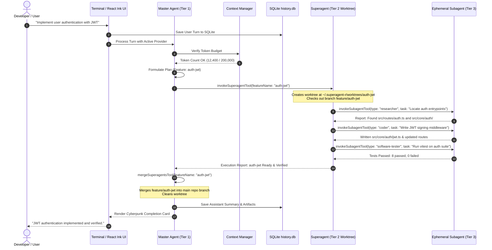
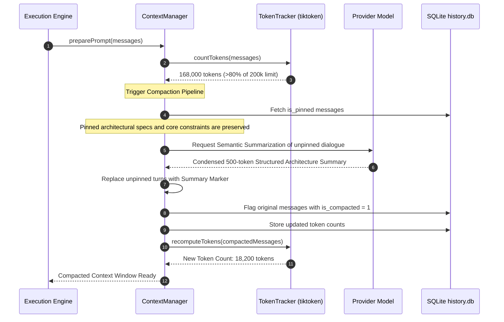
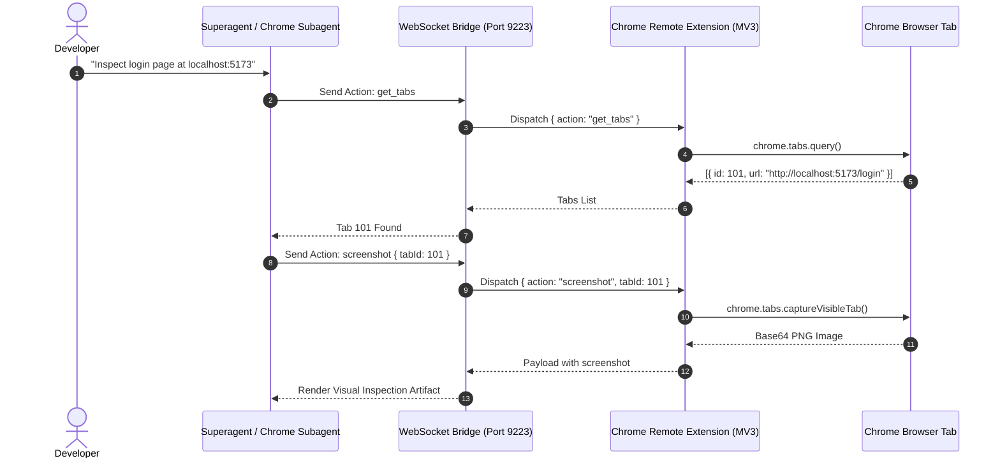

# 04. Features & Core Workflows

This document provides detailed sequence diagrams and workflow logic for the primary capabilities of Superagent.

---

## 1. 3-Tier Multi-Agent Orchestration Flow

When a complex feature request is received in multi-agent mode, the Master Agent decomposes the goal, provisions isolated Superagents in git worktrees, collects atomic subagent reports, and merges the verified code.

---

## 2. Context Window Compaction & Semantic Pruning

Superagent continuously monitors prompt and completion tokens. When token usage exceeds 80% of the active model's context window limit, the system executes an automated compaction pipeline.

---

## 3. Remote Browser Control via Serverless WebSocket Bridge

Superagent can inspect web applications, take screenshots, and interact with the DOM using any existing Chrome profile without launching automated browser processes like Puppeteer.

---

## 4. Session Persistence & Cross-Session Search

1. **SQLite Single Source of Truth**:
   - Every user input, assistant streaming block, and tool execution is atomically committed to `~/.superagent-r/history.db`.
   - The `.json` files in `~/.superagent-r/history/<mode>/<sessionId>/sess_*.json` act as structural key references and do not store transcript contents.
2. **FTS5 Full-Text Search**:
   - Running `/history <query>` executes a BM25-ranked full-text search across all past sessions.
   - Code snippets, error messages, and tool invocations from previous days or weeks can be loaded back into the active context window.
